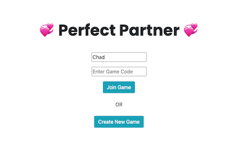
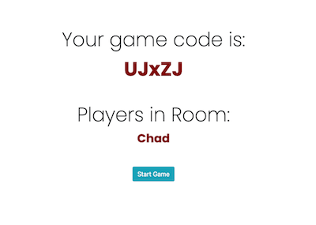
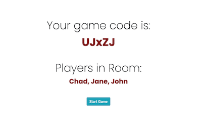
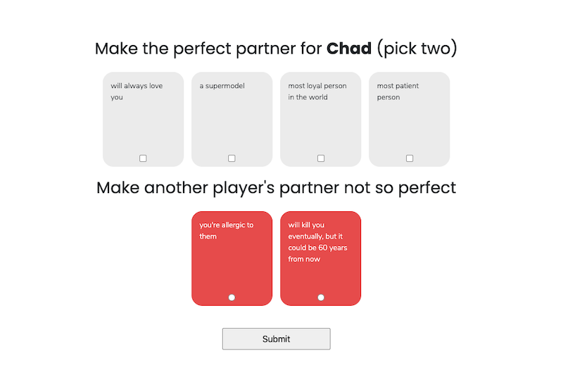
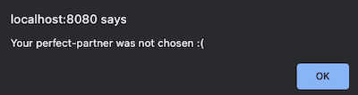

# Perfect Partner

## Description

Based on Red Flags the card game, this is a simple online implementation meant to be played
with friends while using an external group audio chat such as discord.

The game can be played here: <https://confident-kepler-b716c5.netlify.app/>

## How to Play the Game

A minimum of three players is required to start a new game.

1. Player One will enter their name and press "Create New Game"  

2. They will receive a game code to share with their friends.  

3. Other players can then enter their name, the game code, and press "Join Game".  

4. After at least 2 other people have joined the room/lobby, Player One will be able to start the game.  
  

5. One player is selected as the current "dater" and will be shown the following screen:  

6. All other players will be trying to create the perfect partner for the current dater. They can select two white cards and one red card. The red card is randomly assigned to another player.  

7. Once all players have submitted their perfect parter everyone is shown the different partner options.
The current dater will be able to select one winner from the options and submit their choice.  

8. The player whose perfect partner was chosen will receive this alert:  

9. All other players will receive this alert:  

The game continues until each player has been the "dater" twice.

## Technologies Used

Front-End: VanillaJS  
Back-End: Node.js + socket.io  
Deployment: Netlify + Heroku  
